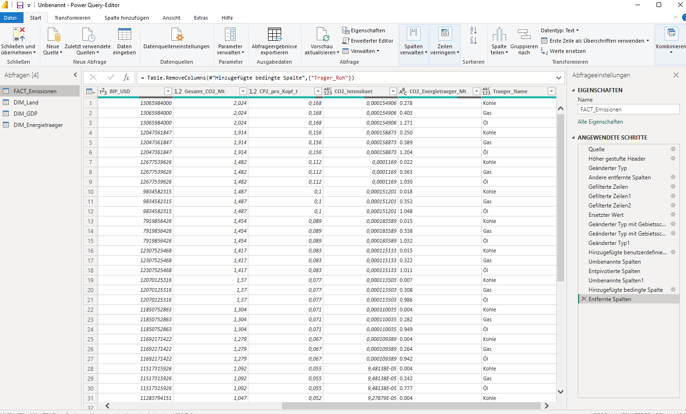
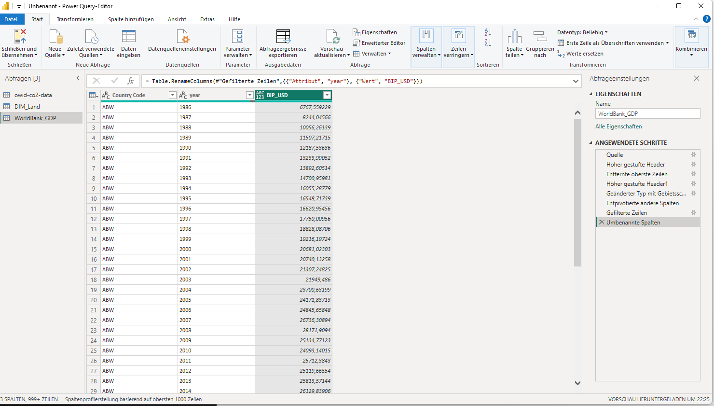
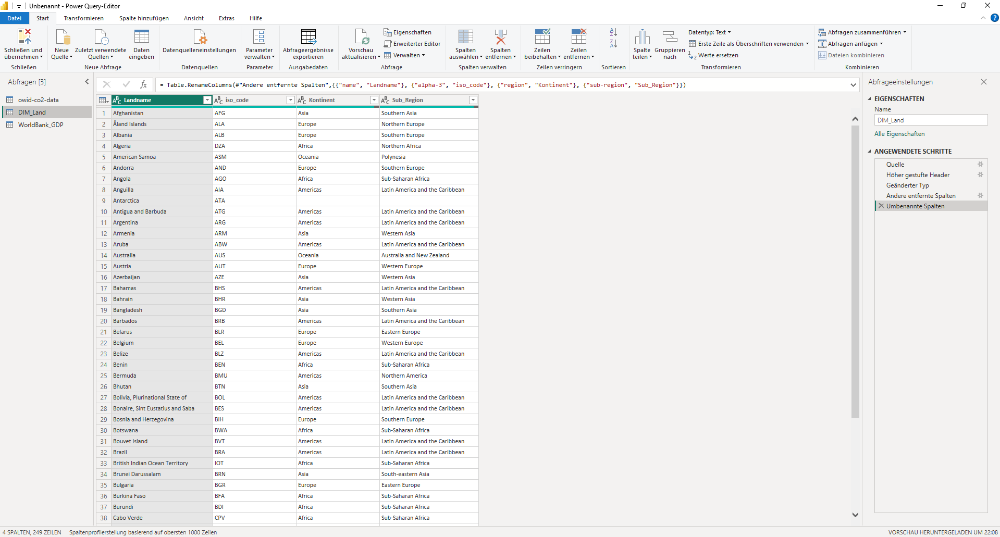
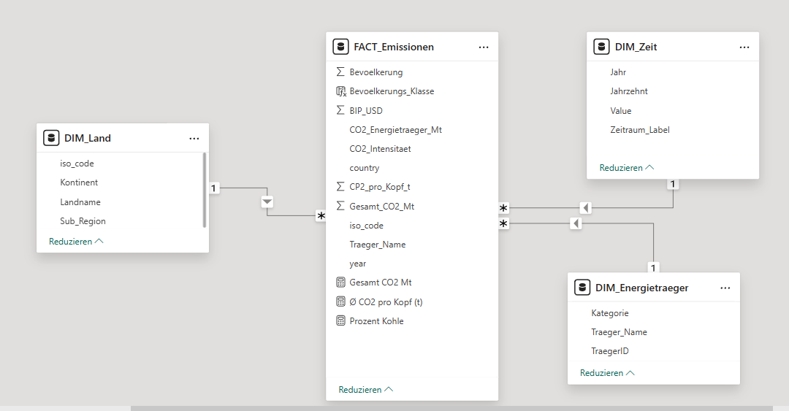

= BI-Projekt: Globale CO₂-Emissionen & Wirtschaftskraft
Vorwissenschaftliche Arbeit – DBI 5. Klasse
:toc: left
:toc-title: Inhaltsverzeichnis
:toclevels: 2
:icons: font
:source-highlighter: rouge
:sectnums:
:figure-caption: Abbildung
:table-caption: Tabelle

// ============================================================
== Slide 1: Projektidee & Forschungsfragen
// ============================================================

=== Projektidee

Dieses BI-Projekt analysiert den Zusammenhang zwischen globalen *CO₂-Emissionen*, der *Wirtschaftskraft (BIP pro Kopf)* und der *Bevölkerungsgröße* auf Länder- und Kontinentebene.
Ziel ist es, mithilfe eines multidimensionalen Datenwürfels (OLAP-Cube) aussagekräftige Erkenntnisse über Ursachen und geografische Verteilung von Treibhausgasemissionen zu gewinnen.

Geografische Visualisierungen spielen dabei eine zentrale Rolle: Jede Zeile der Faktentabelle enthält einen ISO-3166-Ländercode (Alpha-3), der eine direkte Kartendarstellung in Power BI ermöglicht.

---

=== Forschungsfragen

[cols="1,3,5", options="header"]
|===
| # | OLAP-Operation | Forschungsfrage

| 1
| *Slice*
| Wie verteilen sich die Pro-Kopf-CO₂-Emissionen weltweit *im Jahr 2022* – welche Länder emittieren besonders viel?

| 2
| *Dice*
| Wie hoch sind die Gesamt-CO₂-Emissionen in *Europa* im Zeitraum *2000–2022*, und wie verändert sich der Anteil von kohle-, öl- und gasbedingten Emissionen?

| 3
| *Drill-down*
| Wenn man von der *Kontinentebene* auf die *Länderebene* herunterbricht: Welche europäischen Länder treiben die Gesamtemissionen Europas am stärksten an, und steht das im Verhältnis zu ihrem BIP pro Kopf?

|===

NOTE: Die drei Forschungsfragen decken bewusst alle OLAP-Kernoperationen ab (Slice → eine Dimension fixieren, Dice → mehrere Dimensionen gleichzeitig einschränken, Drill-down → Granularität erhöhen) und bauen thematisch aufeinander auf.

// ============================================================
== Slide 2: Hauptdatenquelle(n)
// ============================================================

=== Datenquelle 1 – Our World in Data: CO₂ & Greenhouse Gas Emissions

[cols="2,5", options="header"]
|===
| Eigenschaft | Beschreibung

| *Name*
| OWID CO₂ and Greenhouse Gas Emissions Dataset

| *Organisation*
| Our World in Data (Oxford, UK)

| *Format*
| CSV (eine Zeile pro Land und Jahr)

| *Umfang*
| ~300 Länder/Regionen, Jahrgang 1750–2023, 79 Spalten

| *Lizenz*
| Creative Commons BY 4.0

| *Source-Link*
| https://raw.githubusercontent.com/owid/co2-data/master/owid-co2-data.csv

| *Dokumentation*
| https://github.com/owid/co2-data

| *Update-Frequenz*
| Jährlich (neues *Global Carbon Budget* → inkrementeller Anhang neuer Jahresdaten)

|===

==== Lifetime-Strategie: Inkrementell + Update

[cols="1,4", options="header"]
|===
| Strategie | Beschreibung

| *Inkrementell (Incremental Load)*
| Jedes Jahr fügt OWID neue Zeilen für das abgeschlossene Berichtsjahr hinzu. In Power BI wird über einen Jahresfilter gesteuert, sodass nur neue Jahresdaten nachgeladen werden, ohne den gesamten Datensatz neu zu importieren.

| *Update (Full Refresh für Korrekturen)*
| Wenn historische Werte rückwirkend korrigiert werden (z. B. Methodenänderung im Global Carbon Project), aktualisiert OWID bestehende Zeilen. Ein monatlich ausgeführter Full-Refresh in Power BI Service stellt sicher, dass Korrekturen übernommen werden.

|===

==== Wichtige Spalten (Auswahl)

[cols="2,4", options="header"]
|===
| Spaltenname (nach Bereinigung) | Bedeutung

| `country` | Ländername
| `iso_code` | ISO 3166-1 Alpha-3-Code – Basis für geografische Visualisierung
| `year` | Berichtsjahr
| `Gesamt_CO2_Mt` | Gesamt-CO₂-Emissionen in Megatonnen (umbenannt aus `co2`)
| `CP2_pro_Kopf_t` | CO₂ pro Einwohner in Tonnen (umbenannt aus `co2_per_capita`)
| `coal_co2` / `oil_co2` / `gas_co2` | Emissionsanteile nach Energieträger
| `BIP_USD` | BIP in US-$ PPP (umbenannt aus `gdp`)
| `Bevoelkerung` | Einwohnerzahl (umbenannt aus `population`)

|===

==== Schritte der Datenbereinigung (Power BI / Power Query)

[cols="1,5", options="header"]
|===
| Schritt | Beschreibung

| 1 – Spalten auswählen
| Nur die relevanten Spalten behalten; alle nicht benötigten der 79 Spalten entfernen (über „Spalten auswählen").

| 2 – Filtern auf Länder
| Zeilen entfernen, bei denen `iso_code` leer ist oder mit `OWID_` beginnt (aggregierte Regionen wie „World", „Asia" etc.).

| 3 – Jahresfilter
| Auf Zeitraum 1990–2023 einschränken, da vor 1990 viele Felder spärlich befüllt sind.

| 4 – Datentypen mit Gebietsschema
| Dezimalspalten mit „Mit Gebietsschema verwenden → Englisch (USA)" konvertieren, da die CSV Punkt als Dezimalzeichen verwendet (Konflikt mit deutschem Windows-Standard).

| 5 – Null-Behandlung
| Spalten `coal_co2`, `oil_co2`, `gas_co2`: fehlende Werte (null) werden auf `0` gesetzt.

| 6 – Spalten umbenennen
| Spaltennamen sprechend umbenennen: `co2` → `Gesamt_CO2_Mt`, `co2_per_capita` → `CP2_pro_Kopf_t`, `gdp` → `BIP_USD`, `population` → `Bevoelkerung`.

| 7 – Berechnete Spalte
| `CO2_Intensitaet` = `Gesamt_CO2_Mt / (BIP_USD / 1.000.000)` – Emissionen pro Mrd. USD BIP.

| 8 – Entpivotieren Energieträger
| Spalten `coal_co2`, `oil_co2`, `gas_co2` entpivotieren → neue Spalten `Traeger_Name` (Kohle/Öl/Gas) und `CO2_Energietraeger_Mt`. Ermöglicht die Verbindung zu `DIM_Energietraeger`.

|===

.Power Query – Angewendete Schritte: `FACT_Emissionen`

---

=== Datenquelle 2 – World Bank: GDP per Capita (Update-Quelle)

[cols="2,5", options="header"]
|===
| Eigenschaft | Beschreibung

| *Name*
| GDP per capita (current US$) – NY.GDP.PCAP.CD

| *Organisation*
| The World Bank (Open Data)

| *Format*
| CSV (ZIP-Archiv, wide-format mit Jahresspalten)

| *Source-Link*
| https://api.worldbank.org/v2/en/indicator/NY.GDP.PCAP.CD?downloadformat=csv

| *Dokumentation*
| https://data.worldbank.org/indicator/NY.GDP.PCAP.CD

| *Update-Frequenz*
| Jährlich (Werte werden rückwirkend revidiert → Full-Update)

|===

NOTE: Die World-Bank-Daten dienen als *Update-Quelle* für aktuelle BIP-Werte. Sie sind in Power Query als separate Abfrage enthalten und dokumentieren die Update-Lifetime-Strategie. Die Tabelle ist nicht direkt als Dimension im Modell verbunden, da BIP-Werte bereits in der OWID-Hauptquelle enthalten sind.

==== Schritte der Datenbereinigung (World Bank CSV)

[cols="1,5", options="header"]
|===
| Schritt | Beschreibung

| 1 – Kopfzeilen entfernen
| Erste 4 Zeilen (Metadaten-Header) entfernen; echte Spaltenbezeichnungen aus Zeile 5 als Header übernehmen.

| 2 – Entpivotieren (Unpivot)
| Wide-format (eine Spalte pro Jahr) mit „Andere Spalten entpivotieren" in long-format (Land, Jahr, Wert) umwandeln.

| 3 – Metadaten-Zeilen filtern
| Zeilen mit nicht-numerischen Werten in der Jahres-Spalte herausfiltern.

| 4 – Spalten umbenennen & Datentypen
| `Country Code` → `iso_code`; `Attribut` → `year`; `Wert` → `BIP_USD`. Datentypen mit Gebietsschema Englisch (USA) setzen.

|===

.Power Query – Angewendete Schritte: `DIM_GDP` (Update-Quelle World Bank)

// ============================================================
== Slide 3: Enrichment-Dateien
// ============================================================

=== Enrichment 1 – Länder-Kontinent-Mapping (ISO 3166 + UN Geoscheme → `DIM_Land`)

[cols="2,5", options="header"]
|===
| Eigenschaft | Beschreibung

| *Idee*
| Der OWID-Datensatz enthält keinen Kontinent-Eintrag je Land. Um die Drill-down-Forschungsfrage (Kontinent → Land) zu ermöglichen, wird eine Mapping-Tabelle hinzugefügt.

| *Quelle*
| GitHub – lukes/ISO-3166-Countries-with-Regional-Codes

| *Source-Link*
| https://raw.githubusercontent.com/lukes/ISO-3166-Countries-with-Regional-Codes/master/all/all.csv

| *Inhalt*
| Land, Alpha-3-Code, Region (Kontinent), Sub-Region

| *Lizenz*
| MIT License

|===

==== Zweck des Enrichments

* Ermöglicht die *geografische Hierarchie* im Datenwürfel: Kontinent → Sub-Region → Land
* Jede CO₂-Zeile kann damit einem von 6 Kontinenten zugeordnet werden
* Ermöglicht *geografische Kartendarstellung* in Power BI (Map-Visual) auf Basis des `iso_code`

==== Schritte der Datenbereinigung/Aufbereitung

[cols="1,5", options="header"]
|===
| Schritt | Beschreibung

| 1 – Spalten auswählen
| Nur `name`, `alpha-3`, `region` und `sub-region` behalten; restliche Spalten entfernen.

| 2 – Umbenennen
| `name` → `Landname`; `alpha-3` → `iso_code`; `region` → `Kontinent`; `sub-region` → `Sub_Region`.

| 3 – Tabelle umbenennen
| Abfrage in Power BI als `DIM_Land` benennen.

|===

.Power Query – Angewendete Schritte: `DIM_Land`

---

=== Enrichment 2 – Bevölkerungsklassen-Binning (auf Basis OWID-Daten)

[cols="2,5", options="header"]
|===
| Eigenschaft | Beschreibung

| *Idee*
| Die absolute Bevölkerungsgröße eines Landes ist bereits in der OWID-Hauptquelle enthalten. Durch ein *Binning* (Klassenbildung) kann jedes Land in eine von vier Größenklassen eingeteilt werden. Das erlaubt Vergleiche wie: „Emittieren Kleinststaaten pro Kopf mehr als Großstaaten?"

| *Quelle*
| Bereits enthalten in: Our World in Data CO₂-Dataset (Spalte `Bevoelkerung`)

| *Source-Link*
| https://raw.githubusercontent.com/owid/co2-data/master/owid-co2-data.csv

| *Lizenz*
| Creative Commons BY 4.0

|===

==== Binning-Klassifizierung (DAX-Spalte in `FACT_Emissionen`)

[cols="1,2,3", options="header"]
|===
| Klasse | Kriterium | Beispiele

| `"Gigantisch"` | Bevölkerung > 100 Mio. | China, Indien, USA
| `"Groß"` | 10–100 Mio. | Deutschland, Frankreich, Ägypten
| `"Mittel"` | 1–10 Mio. | Österreich, Dänemark, Slowakei
| `"Klein"` | < 1 Mio. | Island, Luxemburg, Malediven

|===

// ============================================================
== Slide 4: Datenwürfel – Dimensionen & Fakten
// ============================================================

=== Überblick Data Cube

Der multidimensionale Datenwürfel besteht aus einer zentralen *Faktentabelle* (`FACT_Emissionen`) und drei direkt verknüpften *Dimensionstabellen* im Stern-Schema.

.Star-Schema – Power BI Modellansicht (Screenshot)

---

=== Faktentabelle: `FACT_Emissionen`

[cols="2,2,4", options="header"]
|===
| Spaltenname | Datentyp | Bedeutung / Herkunft

| `iso_code` | Text (FK) | ISO 3166 Alpha-3 → Join zu DIM_Land
| `year` | Ganzzahl (FK) | Berichtsjahr → Join zu DIM_Zeit
| `Traeger_Name` | Text (FK) | Energieträger → Join zu DIM_Energietraeger
| `country` | Text | Ländername (aus OWID-Datei)
| `Gesamt_CO2_Mt` | Dezimal | Gesamt-CO₂ in Megatonnen (OWID)
| `CP2_pro_Kopf_t` | Dezimal | CO₂ pro Einwohner in Tonnen (OWID)
| `CO2_Energietraeger_Mt` | Dezimal | CO₂ des jeweiligen Energieträgers (entpivotiert)
| `BIP_USD` | Dezimal | BIP in US$ PPP 2011 (OWID)
| `Bevoelkerung` | Ganzzahl | Einwohnerzahl (OWID)
| `CO2_Intensitaet` | Dezimal | *Berechnete Spalte*: `Gesamt_CO2_Mt / (BIP_USD / 1.000.000)`
| `Bevoelkerungs_Klasse` | Text | *Binning (DAX)*: Gigantisch / Groß / Mittel / Klein

|===

NOTE: `CO2_Intensitaet` und `Bevoelkerungs_Klasse` sind *berechnete DAX-Spalten* (Bonuspunkte ⭐). Die Entpivotierung der Energieträger ermöglicht die direkte Verbindung zur `DIM_Energietraeger`.

---

=== Dimensionstabelle 1: `DIM_Land`

Quelle: GitHub – lukes/ISO-3166-Countries-with-Regional-Codes (`all.csv`)

[cols="2,2,4", options="header"]
|===
| Spaltenname | Datentyp | Beschreibung

| `iso_code` (PK) | Text | ISO 3166 Alpha-3 (Primärschlüssel)
| `Landname` | Text | Offizieller Ländername
| `Kontinent` | Text | z. B. „Europe", „Asia", „Africa"
| `Sub_Region` | Text | z. B. „Western Europe", „Southern Asia"

|===

Beziehung: `FACT_Emissionen[iso_code]` → `DIM_Land[iso_code]` (N:1)

---

=== Dimensionstabelle 2: `DIM_Zeit` (per DAX erstellt)

Direkt in Power BI über *Start → Neue Tabelle* erzeugt:

[source,dax]
----
DIM_Zeit =
ADDCOLUMNS(
    GENERATESERIES(1990, 2023, 1),
    "Jahr", [Value],
    "Jahrzehnt",
        IF([Value] < 2000, "1990er",
        IF([Value] < 2010, "2000er",
        IF([Value] < 2020, "2010er", "2020er"))),
    "Zeitraum_Label",
        IF([Value] < 1997, "Vor Kyoto",
        IF([Value] < 2016, "Post-Kyoto", "Post-Paris"))
)
----

Beziehung: `DIM_Zeit[Value]` → `FACT_Emissionen[year]` (1:N)

[cols="2,2,4", options="header"]
|===
| Spaltenname | Datentyp | Beschreibung

| `Value` (PK) | Ganzzahl | Berichtsjahr 1990–2023
| `Jahrzehnt` | Text | „1990er", „2000er", „2010er", „2020er"
| `Zeitraum_Label` | Text | „Vor Kyoto" (<1997), „Post-Kyoto" (1997–2015), „Post-Paris" (≥2016)

|===

---

=== Dimensionstabelle 3: `DIM_Energietraeger` (manuell erstellt)

Direkt in Power BI über *Start → Daten eingeben* angelegt:

[cols="2,2,4", options="header"]
|===
| Spaltenname | Datentyp | Beschreibung

| `TraegerID` (PK) | Ganzzahl | Surrogatschlüssel
| `Traeger_Name` | Text | „Kohle", „Öl", „Gas"
| `Kategorie` | Text | „Fossil"

|===

Beziehung: `DIM_Energietraeger[Traeger_Name]` → `FACT_Emissionen[Traeger_Name]` (1:N)

NOTE: Die Faktentabelle wurde in Power Query durch *Entpivotieren* der Spalten `coal_co2`, `oil_co2`, `gas_co2` umstrukturiert. Jeder Energieträger ist jetzt eine eigene Zeile in der Faktentabelle, was die Verbindung zu `DIM_Energietraeger` ermöglicht und detaillierte Energieträger-Analysen erlaubt.

---

=== Binning: `Bevoelkerungs_Klasse` (Bonuspunkt ⭐)

Berechnete Spalte in `FACT_Emissionen` (*Datenansicht → Neue Spalte*):

[source,dax]
----
Bevoelkerungs_Klasse =
IF('FACT_Emissionen'[Bevoelkerung] > 100000000, "Gigantisch",
IF('FACT_Emissionen'[Bevoelkerung] > 10000000, "Groß",
IF('FACT_Emissionen'[Bevoelkerung] > 1000000, "Mittel",
"Klein")))
----

---

=== Calculated Measures (Bonuspunkt ⭐)

Erstellt über *„Neues Measure"* in `FACT_Emissionen`:

[cols="3,5", options="header"]
|===
| Measure-Name | DAX-Formel

| `Ø CO2 pro Kopf (t)`
| `AVERAGE('FACT_Emissionen'[CP2_pro_Kopf_t])`

| `Gesamt CO2 Mt`
| `SUM('FACT_Emissionen'[Gesamt_CO2_Mt])`

| `Prozent Kohle`
| `DIVIDE(SUM('FACT_Emissionen'[CO2_Energietraeger_Mt]), SUM('FACT_Emissionen'[Gesamt_CO2_Mt]))`

| `CO2-Intensität Ø`
| `AVERAGE('FACT_Emissionen'[CO2_Intensitaet])`

|===

// ============================================================
== Quellen-Übersicht
// ============================================================

[cols="1,3,3", options="header"]
|===
| # | Quelle | Link

| 1
| Our World in Data – CO₂ & GHG Dataset (Hauptquelle, inkrementell)
| https://github.com/owid/co2-data

| 2
| World Bank – GDP per capita (Update-Quelle, dokumentiert)
| https://data.worldbank.org/indicator/NY.GDP.PCAP.CD

| 3
| lukes/ISO-3166 – Country-Continent-Mapping (Enrichment → `DIM_Land`)
| https://github.com/lukes/ISO-3166-Countries-with-Regional-Codes

|===
