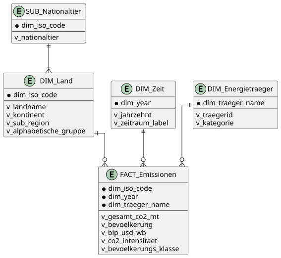
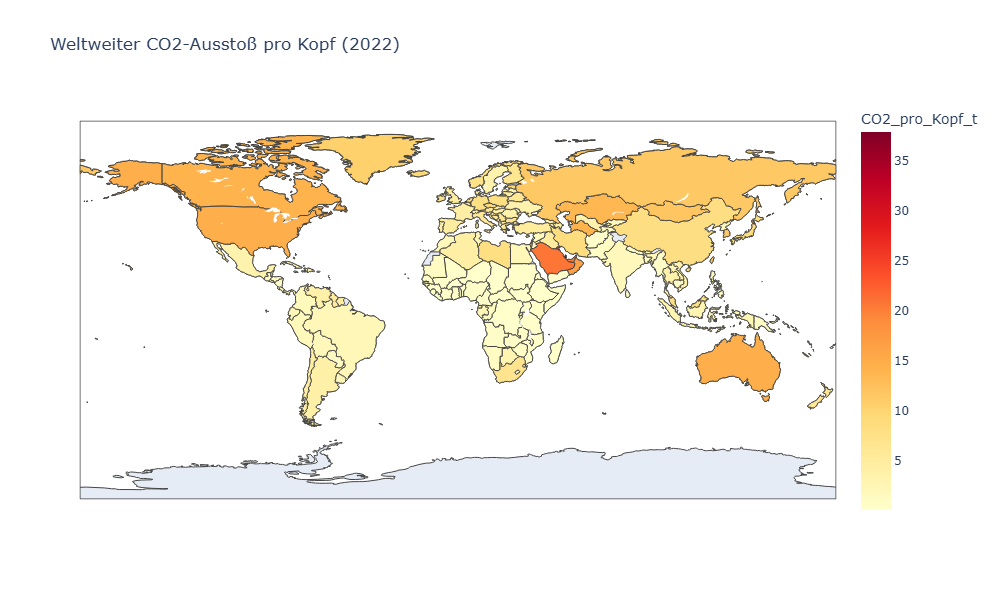
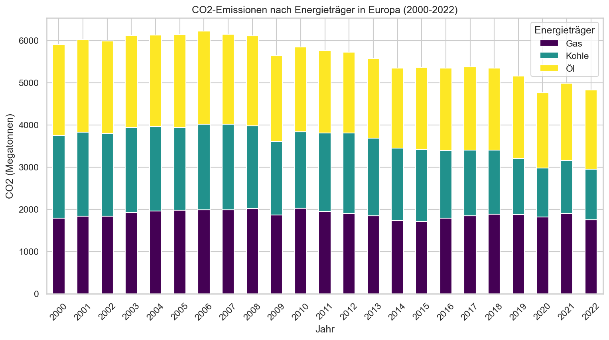
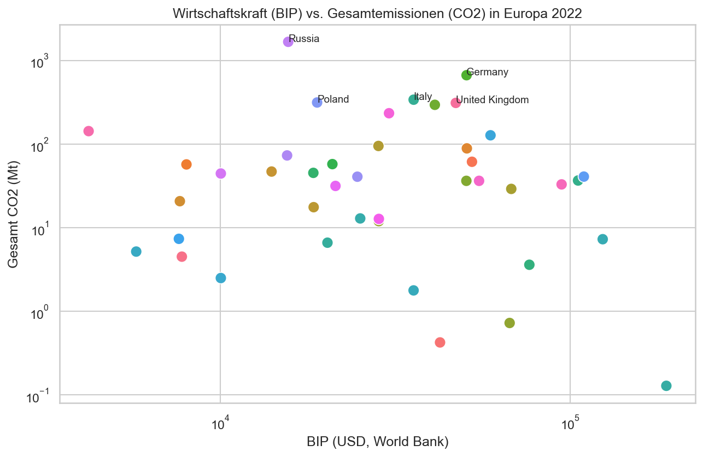
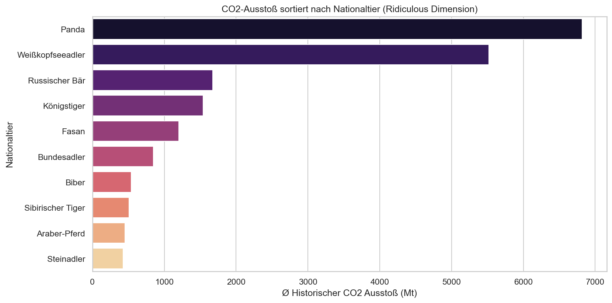
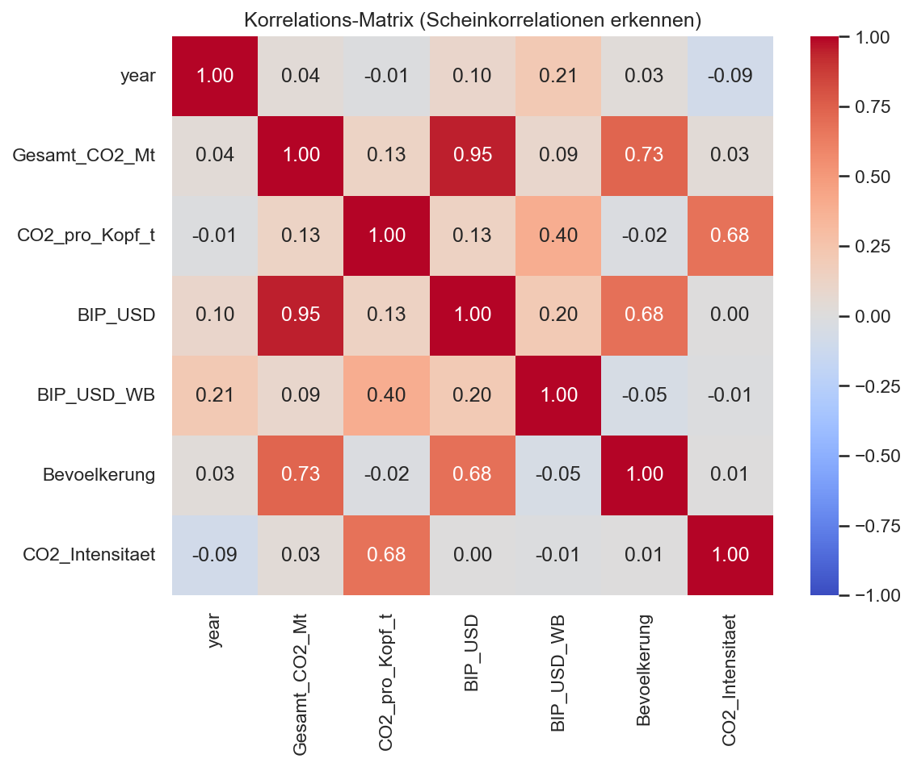

= Business Intelligence: Globale CO2-Analyse
Orhan Softic & David Zimmer
v1.0, 2026
:title-page:
:toc: left
:toc-title: Inhaltsverzeichnis
:sectnums:
:icons: font

// ============================================================
== Slide 1: Idee & Forschungsfragen
// ============================================================

=== Thema
Dieses BI-Projekt analysiert den logischen Zusammenhang zwischen globalen *CO2-Emissionen*, der *Wirtschaftskraft (BIP)* und der *Bevölkerungsgröße* auf Länder- und Kontinentebene. Die Datenverarbeitung wurde als "Code-First"-Ansatz in Python implementiert.

=== Forschungsfragen (OLAP-Operationen)

[cols="1,3,2", options="header"]
|===
| Nr. | Forschungsfrage | OLAP-Operation

| *F1*
| Wie verteilen sich die Pro-Kopf-CO2-Emissionen weltweit *im Jahr 2022* – welche Länder emittieren besonders viel?
| *Slice* - Zeitdimension auf ein Jahr fixiert

| *F2*
| Wie hoch sind die Gesamt-CO2-Emissionen in *Europa* im Zeitraum *2000–2022*, und wie unterscheidet sich der Anteil von Kohle-, Öl- und Gasverbrennung?
| *Dice* - Filterung auf geographische Region Kontinent sowie Zeitraum gleichzeitig

| *F3*
| Drill-Down von *Kontinentebene* auf *Länderebene*: Welche europäischen Staaten treiben die Gesamtemissionen Europas an, und wie ist dies im Verhältnis zur ihrer Wirtschaftskraft (BIP)?
| *Drill-Down* - Aggregationsebene von Europa auf Länder herabbrechen
|===

---

// ============================================================
== Slide 2: Hauptdatenquellen
// ============================================================

=== Datenquelle 1: Our World in Data - CO2 Dataset 
* *Typ*: Incremental (jährlich um ein neues Kalenderjahr ergänzt)
* *Inhalt*: Detaillierte Aufschlüsselung globaler CO2-Emissionen, Energieträger, BIP, Bevölkerung etc. pro Land (Zeile = Land pro Jahr). Ca. 79 Spalten.
* *Quelle*: https://raw.githubusercontent.com/owid/co2-data/master/owid-co2-data.csv

=== Datenquelle 2: World Bank GDP per capita (Update-Quelle)
* *Typ*: Update (Vergangene historische BIP-Werte werden bei Datenänderungen geupdatet)
* *Inhalt*: Jährliches GDP (BIP) als Wide-Format (eine Spalte pro Jahr). Dient im Modell als Update-Quelle.
* *Quelle*: https://api.worldbank.org/v2/en/indicator/NY.GDP.PCAP.CD?downloadformat=csv

=== Data-Cleansing-Schritte in Python (Pandas)
[cols="1,3", options="header"]
|===
| Schritt | Python Implementierung / Beschreibung

| 1. Spaltenauswahl 
| `df[['iso_code', 'year', 'co2', ...]]` - Unnötige Spalten entfernen.

| 2. Zeilen-Filterung 
| `df.dropna(subset=['iso_code'])` um aggregierte Regionen herauszufiltern. 

| 3. Zeit-Filter 
| `df[(df['year'] >= 1990) & (df['year'] <= 2023)]` - Beschneidung auf Relevanz.

| 4. Null-Werte 
| `df[col].fillna(0)` für spezifische Energieträgerspalten.

| 5. Umbenennungen 
| `df.rename(columns={'co2_per_capita': 'CO2_pro_Kopf_t'})` für bessere Beschreibungen.

| 6. World Bank (Update Quelle) 
| Wide-Format CSV der WorldBank: via `pd.melt()` in Long-Format umgewandelt und als `BIP_USD_WB` direkt per Left-Join (`iso_code` + `year`) an die Faktentabelle gemerged.

| 7. Energieträger Entpivotieren 
| Die Spalten `coal_co2, oil_co2, gas_co2` via `pd.melt()` umwandeln, um in Folge eine separate `DIM_Energietraeger` zu verknüpfen.
|===

<<<

// ============================================================
== Slide 3: Enrichment-Dateien
// ============================================================

=== Enrichment 1: Länder-Kontinent Mapping (ISO 3166)
* *Idee*: Der OWID-Datensatz besitzt von sich aus keine geographischen Kontinent-Hierarchien. Um Forschungsfrage 3 (Kontinent Drill-Down) auszuführen und geographische Karten (Geo-Plots) zu bedienen, müssen die ISO-Codes mit Kontinenten gemerged werden.
* *Inhalt*: Land, ISO-Alpha-3 Code, Region, Sub-Region
* *Quelle*: https://raw.githubusercontent.com/lukes/ISO-3166-Countries-with-Regional-Codes/master/all/all.csv

==== Data-Cleansing
* Entfernen aller Spalten bis auf Name, Alpha-3 (Join-Keys), Region und Sub-Region.
* Umbenennung zu sprechenden Bezeichnern.

=== Geodaten (Optional für Leaflet/Folium Plot)
In der Datenquelle `owid_co2_data.csv` existiert bereits eine Spalte `iso_code`. Diese geographische Information wird beim späteren Erstellen des Dashboards Python-Packages wie _Plotly_ automatisch verwendet, um geographische Heatmaps auf der Erdkugel zu visualisieren. 

<<<

// ============================================================
== Slide 4: Datenwürfel & Dimensionen
// ============================================================

=== Architektur (Star-Schema via Merges)

Obwohl in Python das BI-Datenmodell oft zu einem großen, einheitlichen Flat-DataFrame verarbeitet wird, basiert die logische Konstruktion des ETL-Prozesses explizit auf einem Star-Schema. Die Python-Pipeline verarbeitet Rohdaten und splittet sie in die jeweiligen Dims/Facts auf, die beim Plotting in ein zentrales Star-Modell geknüpft werden:

.Star-Schema (PlantUML ER-Diagramm)

=== Dimensionen & Faktentabelle

[cols="2,4", options="header"]
|===
| Tabelle | Beschreibung

| *FACT_Emissionen*
| Kern der Daten. Enthält FKs, Population, CO2-Absolute- und Pro-Kopf-Werte sowie die ge-mergten World-Bank BIP Updates (`BIP_USD_WB`). Entpivotiert nach Energieträgern (Kohle, Öl, Gas).

| *DIM_Land*
| ISO-Hierarchien. Länderkürzel verlinkt zu Regionen & Kontinenten.

| *DIM_Zeit*
| Zeitdimensionen. Per Python generiert. Bündelt Jahre zu Dekaden ("2000er") und Klimavertrags-Epochen ("Post-Kyoto", "Post-Paris").

| *DIM_Energietraeger*
| Extraktion der Entpivotierten Energieträgerspalten in eine Dimension `Kohle, Öl, Gas`.
|===

=== Extras: Binning & Calculated Values

Beide Berechnungen wurden dynamisch während des ETL-Laufs via Pandas erzeugt:

**1. Binning: `Bevoelkerungs_Klasse`**
Aufspaltung der stetigen Skala an Population in vier Kategorien durch `pd.cut()`:

* *Klein*: unter 1 Million Einwohner
* *Mittel*: 1 - 10 Millionen
* *Groß*: 10 - 100 Millionen
* *Gigantisch*: über 100 Millionen

**2. Calculated Value: `CO2_Intensitaet`**
Spiegelt die Effizienz der CO2-Erzeugung zur Wirtschaftskraft wider.

* DAX/Pandas Äquivalent: `Gesamt_CO2_Mt / (BIP_USD / 1.000.000)`
* _Szenariodiskussion_: Vergleicht wie viel CO2 beim generieren von einer Millionen USD BIP pro Staat ausgestoßen wird.

<<<

// ============================================================
== Slide 5: Ridiculous Dimensions
// ============================================================
Zusätzlich zu den Kernanforderungen beinhaltet das Datenmodell zwei vollkommen irrsinnige Dimensionen, um die Flexibilität der ETL-Pipeline zu demonstrieren.

=== "Ridiculous" Dimension 1: Alphabetische Ländergruppe
_(Generiert aus bestehenden Basisdaten, keine externe File)_ +
Länder werden basierend auf ihrem Anfangsbuchstaben gruppiert, um auszuwerten, ob der Anfangsbuchstabe eines Landes eine "Scheinkorrelation" zum CO2-Ausstoß hat.

* *A-F*: z.B. Austria, Australia, France
* *G-L*: z.B. Germany, Italy, Japan
* *M-R*: z.B. Mexico, Russia
* *S-Z*: z.B. Sweden, USA (United States), Switzerland

=== "Ridiculous" Dimension 2: Nationaltiere
_(via zusätzlicher Enrichment CSV-Datei `national_animals.csv`)_ +
Jedem Land (ISO-Code) wird sein offizielles/inoffizielles Nationaltier (z.B. Adler, Känguru, Gallischer Hahn) zugewiesen, um zu evaluieren, ob Länder mit Raubtieren als Maskottchen eventuell mehr Fossilbrennstoffe verbrauchen.

<<<

// ============================================================
== Slide 6: Report (Python Visualizations)
// ============================================================
Das Dashboarding und Plotting wurde mittels `Plotly`, `Seaborn` und `Matplotlib` direkt auf Basis der verknüpften Star-Schema CSV-Exportdateien via Code generiert.

=== Slide 6a: Seriöser Report
.Visualisierung 1: CO2 pro Kopf nach Land (Slice 2022 / Geographisch) 

.Visualisierung 2: Energieträgermix in Europa (Dice 2000-2022)

.Visualisierung 3: BIP vs. Gesamtemissionen in Europa (Drill-Down auf Länder)

<<<

=== Slide 6b: Ridiculous Report & Extra Stuff

.Visualisierung 4: Welches Nationaltier stößt am meisten CO2 aus? (Ridiculous Plot)

.Visualisierung 5: Korrelations-Heatmap (Geiler Scheiß / Extra Point)

_Begründung Extra-Stuff:_ Um dem analytischen Kern von Business Intelligence gerecht zu werden, wurde klassisches Machine Learning/Data Science Tooling (Korrelationsmatrizen) eingebaut. Es beweist statistisch, dass z.B. ein starkes BIP in massivster Korrelation zum CO2₂-Ausstoß steht (Echte Korrelation).

<<<

// ============================================================
== Slide 7: Diskussion & Beantwortung
// ============================================================

=== F1 - Slice (Geo-Verteilung 2022)
*Ergebnis*: Saudi-Arabien, die vereinigten Arabischen Emirate und weite Teile Nordamerikas/Osteuropas dominieren die globale Karte des _Pro-Kopf-CO2-Ausstoßes_. 
_Interpretation_: Länder mit enorm hohen Erträgen durch Ölförderung weisen auch bevölkerungsbereinigt extrem schlechte (rote) Emissions-Werte auf, während Westeuropa und Südamerika deutlich moderater agieren.

=== F2 - Dice (Europäischer Energie-Mix 2000-2022)
*Ergebnis*: Insgesamt zeigt sich bei der Auswertung im Balkendiagramm ein klarer, historischer Abwärtstrend der Gesamtemissionen Europas seit dem Jahr 2000.
_Interpretation_: Besonders die Emissionen aus Kohle wurden extrem zurückgefahren (Kohleausstieg), während Gas eine leichte, aber konstante Basisversorgung übernommen hat.

=== F3 - Drill-Down (Wirtschaftskraft vs. Emissionen in Europa)
*Ergebnis*: Der Log-Log-Scatterplot deckt auf, dass Länder wie Deutschland oder UK beim CO2-Ausstoß und BIP im ersten Quadranten ganz oben aufscheinen. 
_Interpretation_: Wirtschaftskraft und Emissionen wachsen grob linear (auf der logarithmischen Achse). Auffällig ist jedoch, dass z.B. Frankreich bei fast identischem BIP wie UK/Deutschland merklich weniger CO2 emittiert – vermutlich zurückzuführen auf starke historische Nuklearenergieanteile (welche im Datensatz keinen Fossil-Fußabdruck erzeugen).

=== Ridiculous Finding
*Ergebnis*: Länder, welche einen großen *Bären* (Russischer Bär) oder große *Vögel* (Adler / USA) als Maskottchen haben, weisen historisch den absolut katastrophalsten CO2-Schnitt auf. Länder mit Springböcken oder Jaguaren sind am umweltfreundlichsten unterwegs.
